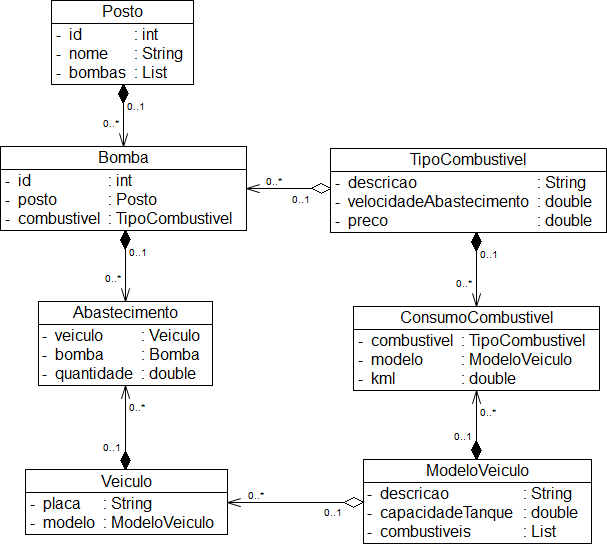
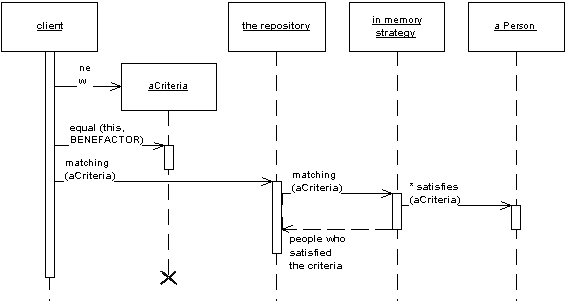

# sgpc - Sistema de Gestão de Postos de Combustiveis

Um posto de combustiveis com duas bombas abastecedoras independentes, uma de etanol e outra de gasolina, recebe veículos de diversas naturezas. 

Os veículos entram no posto em fila única, sendo direcionados para filas individuais das bombas de abastecimento. 

Crie um programa que simule o abastecimento de uma lista de veículos informados nos arquivos fornecidos (modelos.csv e veiculos.csv), realizando o abastecimento apropriado de cada veículo, 
a partir das seguintes premissas:

1. O preço do litro da GASOLINA é R$ 2,90;
2. O preço do litro do ETANOL é R$ 2,27;
3. Velocidade de abastecimento da bomba de gasolina: 10 litros / minuto;
4. Velocidade de abastecimento da bomba de etanol: 12 litros / minuto;
5. Cada veículo pode utilizar um ou mais tipos de combustível;
6. Todos os veículos estão com tanque vazio e os terão completados;
7. Minimizar a razão preço/km rodado ao realizar o direcionamento dos veículos para as bombas;
8. Privilegie a documentação do código, baixo acoplamento e alta coesão na solução proposta, minimizando impactos no caso de alterações nas definições do problema como:

- Possibilidade de incluir novo modelo de veículo
- Possibilidade de incluir novo tipo de combustível
- Possibilidade de incluir nova bomba de combustível
- Possibilidade de mudança no critério de enfileiramento

A saída deve ser produzida na ordem cronológica dos eventos, no seguinte formato (os valores são ilustrativos):

**Resultado da simulação**
...

[00:05] Veículo modelo FIAT-UNO, placa JGA-7389 foi abastecido com 48 litros de ETANOL.

[00:10] Veículo modelo AUDI-A4, placa JGB-1234 foi abastecido com 65 litros de GASOLINA.

**Resumo da simulação**
...
* Total abastecido na bomba 1 (GASOLINA): 1517 litros
* Total abastecido na bomba 2 (ETANOL): 1125 litros
* Total geral abastecido de GASOLINA: 1517 litros
* Total abastecido de ETANOL: 1125 litros

A partir da descrição do problema, foi elaborado o seguinte diagrama de classes da camada de modelo para orientar o desenvolvimento e explicar a proposta de solução: 

Na arquitetura proposta, a camada de serviços encapsula a lógica de negócio e coordena
a resposta da aplicação em cada operação conforme descrito 
por [Martin Fowler](https://martinfowler.com/eaaCatalog/serviceLayer.html)

O design pattern Repository foi utilizado nesse projeto conforme descrito por [Martin Fowler](https://martinfowler.com/eaaCatalog/repository.html) no seu livro Patterns of Enterprise Application Architecture, ou seja, como uma interface entre os objetos do domínio e a camada de dados:

A Repository mediates between the domain and data mapping layers, acting like an in-memory domain object collection. Client objects construct query specifications declaratively and submit them to Repository for satisfaction. Objects can be added to and removed from the Repository, as they can from a simple collection of objects, and the mapping code encapsulated by the Repository will carry out the appropriate operations behind the scenes
